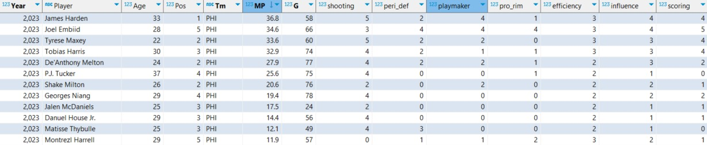
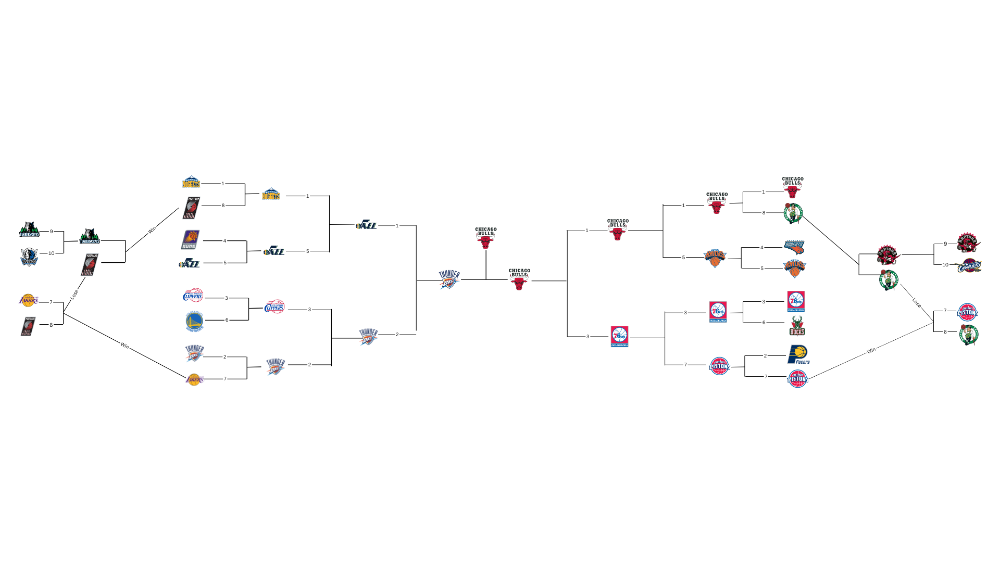
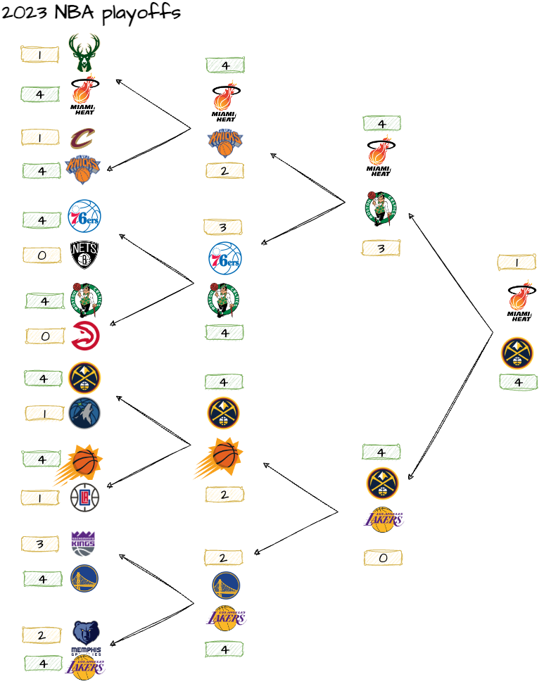
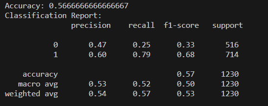

# 2023-24-NBA-Championship-Prediction


Team Members: [Zixuan Xu](https://github.com/ZixuanXu0116), [Munazza Ilyas](https://github.com/Munazza-Ilyas), [Suqian Qi](https://github.com/SuqianQi), [Aahil Navroz](https://github.com/AahilNav), [Joseph Williams](https://github.com/josephwms)

## Introduction
We aim to build a prediction pipeline for an entire NBA season and postseason. Current leading industry methods are complex, really complex: https://fivethirtyeight.com/methodology/how-our-nba-predictions-work/.  We seek to design the best possible product from the ETL to the final prediction.  Significant techniques we used in the project include K-means clustering, random forest classification, and Tableau Visualization.  We hope you enjoy it!


## A. Data Scraping and Preparation
 
***Source:*** 
* Data was scraped from https://www.basketball-reference.com/. We scrape player and team summary statistics for each season, differentiating between the regular season and playoffs data. Next, we scrape HTML files containing game-by-game data, allowing us to retrieve each player's performance and game outcomes for every match.

* A brief workflow of our pipeline is provided below:


***Construct Player Ability Cluster Vector:***
* After obtaining our raw data, we utilized a K-means machine learning classification algorithm for the Player Ability Cluster Vector. Different attributes were employed to classify distinct abilities, and we devised custom weights to calculate the ranking of each cluster. 


* The result is a **Player Ability Vector**. Each player is measured by seven attributes: shooting, peri_def, playmaker, pro_rim, efficiency, influence, and scoring. Each attribute ranges from 0 to 5, where 0 signifies the weakest ability in the respective attribute, while 5 indicates the strongest.

* Here is an example dashboard by Tableau to briefly show how the clusters work

LAL & LAC Players' Scoring & shooting to influence: (https://public.tableau.com/app/profile/zixuan.xu7872/viz/LALLACPlayersScoringShootingtoinfluence/Sheet2#1)


***Predict Next Year's Player Ability Vector:***
* For predicting the ability vector of a given year, we want some way to adjust last year's player's ability vectors to make it a predicted one for this year. As a motivation, we used the following article:

NBA Players Peak age Distributions: https://www.linkedin.com/pulse/analysing-predicting-peak-age-nba-players-data-science-marcus-chua/

* For the regular season, player's cluster scores were adjusted positively for younger players and negatively for older players. For playoffs, we gave positive adjustments to players who had played in the previous year's playoffs (experienced under pressure) and negative adjustments to rookies, or players who had not played in the previous year's playoffs. See below for the interpretation:

Influence ability change vs Age (https://public.tableau.com/app/profile/zixuan.xu7872/viz/InfluenceabilitychangevsAge/Sheet2#1)

***Construct Team Ability Matrix:***
* Having obtained the ability vectors for each player in each regular season and playoffs, it is natural to establish a **Team Ability Matrix**. For each team, we select the nine players with the most playing time (5 starters and 4 key bench players): these are the key players of a team. Next, we form a 9x7 ability matrix with these nine players and their seven attributes' cluster values. Finally, we add some other columns of age, on-court positions, time played, and game played. The result is a **Team Ability Matrix** for each team and season, for both regular season and playoff formats. Here is an example:





***Get Game Schedule:***
* After obtaining the ability matrix, the next challenge is to acquire the schedule for the entire season. In a league with 30 teams, a regular season typically involves each team playing 82 games. Therefore, the total number of games per season is 82 × 15, 1230 games in total. We utilized the game-by-game data to form a schedule for each team reporting the game date, home team, away team, and the win/loss of the home team. This schedule is necessary for our next step: model training!


## B. Making Prediction

***Construct Prediction Model:***
* With all the data prepared, we can proceed with the predictions. To predict the result of any game, we construct a machine-learning model. We treat the ability/attribute matrices for the two teams as the total features for predicting the result of a single game. The result column serves as the real outcome of each game and is used for validation and evaluation. By training the model on the results of all games from the 2015 to 2022 season, we aim to predict the outcomes of games in the 2023 season. For the simulation of each game, we can repeat n times by setting an iteration parameter, and choose the majority as the winner of that game.

***Play-in Games Prediction:***
* Since the rule of entering the playoffs changed after COVID-19, we added the play-in games into consideration. For the 2022-2023 regular season, we obtained the predicted results for each game. Then, we calculated the total wins and losses for each team in this season, allowing us to rank them. We selected teams that ranked 7th to 10th in both the Eastern and Western Conferences, which would participate in the play-in games. Next, we designed an algorithm to simulate the play-in games based on the real rules so that we can determine which team makes the playoffs. To let the users gain engagement in the simulating process, there is a component that allows users to input the second-round matchup of the play-in games.

***Playoffs Prediction:***
* After simulating the regular season using the simulate_regular_season.py, we were able to identify the final top eight teams for each conference.  We conclude our process by running the simulate_playoffs.py, which predicts outcomes and winners for each round of the playoffs, taking into account home team advantage for each match (very relevant in playoffs!). We will let the results of all the playoff series output in the terminal, so you will witness the birth of a predicted NBA champion!


## C. Result & Model Evaluation

 Here are the predicted vs actual results for the 2022-2023 playoffs.  For this particular simulation, we were able to accurately predict nine out of the sixteen total playoff teams.

### Predicted Results



### Actual Results




### Model Evaluation


* For the model evaluation, here is our report:




## D. Limitations

* One main limitation of this plan is that we ***didn't train a separate model for the playoff data***; instead, we still used the model trained on regular season data to predict playoffs (due to limited time). Ideally, a dedicated training for previous seasons' playoff data should be done.

* Additionally, for rookie players and those who didn't play in the previous season, we used current season data. This approach isn't ideal as it ***incorporates future information to predict the future***, but again due to ***time limitations***, we temporarily adopted this method to ensure the completion of the entire process.

* Another area for potential improvement is exploring additional methods to enhance the accuracy of our model predictions.  See the earlier link (https://fivethirtyeight.com/methodology/how-our-nba-predictions-work/). We might engage in more feature engineering, refining the selection of truly valuable features. For instance, in clustering, we can seek more precise and professionally segmented data to ***define clusters***. We could also experiment with creating additional clusters or combining existing ones to identify the most effective combinations for prediction, rather than being confined to a single configuration.
 
* Given that the current combination incorporates ***subjective elements based on our understanding of basketball and the NBA***, exploring various combinations may provide better predictive outcomes. Adjusting the weights assigned to a player's improvement and regression, based on a more realistic or finely segmented allocation, is another aspect to explore.

## E. Further Improvements

* We could consider experimenting with ***different models***. While our current attempts have been somewhat limited to machine learning, venturing into ***deep learning*** might yield higher prediction accuracy. We possibly need more ***parameter tuning*** combined with some grid search methods. However, it's important to note that there's no guarantee of a definite improvement, but it's a direction worth exploring and putting effort into.

* We once considered ***constructing a comprehensive dataset for the first 20 games of each season*** using the data from each game. This approach would allow us to combine the data from the previous season with the data from the first 20 games of the current season for ***a more accurate estimation*** of current player abilities and the current status of teams. Subsequently, using this data, we could predict the outcomes of games after the initial 20 matches. Adding the results of the first 20 games to predict playoff contenders and, within the playoff predictions, forecast the eventual champion is an area where we can enhance our model. We began writing some code to scrape player average plus-minus values for the first 20 games as an attempt to implement this idea. However, due to the substantial workload and time constraints, we couldn't complete this aspect of the work. Nevertheless, we do have plans to refine this approach in the future because it has the potential to make the entire model more logical, compelling, and likely more precise in its predictions.

* A comprehensive effort could be placed on rewriting the scraping process to run more smoothly and quickly (see below 'Things to Mention').

* For the ***feature selection*** in our prediction model, we ultimately did not incorporate any ***team-specific features***. This decision wasn't due to the belief that team features are unimportant, but rather, creating highly effective team features with our current data and limited time posed significant challenges. We are well aware that team data is commonly utilized in match predictions, but our model aims to explore a different path. The player ability matrix, a unique concept we introduced, serves as a testament to this unconventional approach. We are eager to evaluate the viability of this idea. In the future, given the capability and time, we may introduce team-specific features and refine the player ability matrix to construct improved features and models.

* We also wrote code to ***update the database***, focusing on the data from the current 2023-24 season. Our original intention was to create a predictive model that could be updated in real-time daily. However, due to time constraints, we only managed to accomplish the basic task of updating fundamental data. We did not complete the integration of the updated data with the model or even produce an interactive real-time updating dashboard. Insufficient manpower and time hindered us from achieving this, but it remains an area for future improvement and enhancement.

## F. Things to Mention

* Throughout the entire process of data manipulation, model development, and simulating match results, there are indeed some challenging aspects. The first significant challenge is the considerable time required to extract HTML data for each game from the monthly game HTML. With data spanning 10 seasons and approximately 1230 games per season, this totals over 10,000 games. The complexity of each game's data, coupled with potential timeouts during scraping, may necessitate around 70 hours for data retrieval.

* If you wish to replicate the entire process from scratch and create a new database using your account, it would indeed take more than 70 hours to run these codes. However, if you prefer not to undertake this task, you can directly use our GCP Database, which already contains the data we need. Additionally, within the game data, there are some erroneous entries due to mistakes by official website record keepers. While some of these errors can be removed using code, others require a more intricate screening process, involving both code-based filtering and manual review. To address this, we provide a code named "check_database_problems". Following the instructions in this code allows you to rectify your self-created database, a crucial step for generating accurate season schedules. Failure to rectify errors can lead to inaccuracies in the generated schedules, but with proper correction, accurate schedules can be produced. These challenges are integral aspects of the entire operational process.

* As some codes generate intermediate products that cannot be directly input into the database, it might be necessary to store certain results in a temporary CSV file. For these codes, special attention must be paid to the working directory and the order in which codes are executed. I will provide a sequence for running the entire code process. If you deviate from this sequence, you might make incorrect modifications to the database, resulting in potential errors during execution or the generation of faulty models.


This zip provides the outputs for get_gamely_html (without running codes for over 70 hours!): [https://drive.google.com/file/d/1rDECUtqfObDgGxkqTo-9oiiPt-PdRXNL/view?usp=sharing](https://drive.google.com/file/d/1k8zsEqM_jZhWDjrp_ucFtuAPou4i7BM_/view?usp=sharing)


## G. Reproducing Results

***Setup and data scraping:***
* Create a Google Cloud Platform (GCP) account and set up a project.
* Enable the necessary APIs for your project, such as the PostgreSQL API if you're using PostgreSQL.
* Create a database on GCP.
* After the GCP database has been set up completely, please follow the commands and instructions below.

```linux

git clone git@github.com:ZixuanXu0116/2023-24-NBA-Championship-Prediction.git

cd 2023-24-NBA-Championship-Prediction

pip install -r requirements.txt 

```

* Then create a .env file in the same format as demo.env by changing the attributes inside like passwords, host, and database_name to the ones of your own database. You can edit the content in the demo.env directly and then run:


```python
cp demo.env .env

```

* In this way, you will set up the dotenv file for loading data into the database, then run the following Python code, please note that if you wanna run this code below and you are connecting our database, you should first delete the tables named nba_playoffs/regular_normal/advanced_player/team_data, 8 tables in total in our database in the Dbeaver, and then run the following code:

```python
python3 code/scraping/get_NBA_data.py

```

Thus, I would recommend if you really wanna test the reproducibility, you'd better use your own GCP PostgreSQL database account as the .env and then run our code. If you don't want the boring process of retrieving data, you can directly use our database directly without running the code above, no matter which way you choose, the key is to follow the instructions.


* Since the data of the NBA 2023-24 Regular Season will be updated for now (2023/12), i.e. almost new game stats every day, we provide a code to update data automatically every day. You can set up an automatic code execution in the following method in your terminal:

```python
crontab -e
0 0 * * * (your_directory)/code/scraping/update_data.py

```
Then we start to get the game-by-game data for each season using the following codes, first get the monthly HTML containing game-by-game in each month:

```python
python3 code/scraping/get_monthly_html.py

```

Then run the following code to get the Gamely HTML containing game-by-game data for each game in each season, it will be very time-consuming work. ***If you don't wanna run this for over 70 hours, you can choose to directly use the organized Gamely HTML zip folder for each season inside this Google Drive Link:*** [https://drive.google.com/file/d/1rDECUtqfObDgGxkqTo-9oiiPt-PdRXNL/view?usp=sharing](https://drive.google.com/file/d/1k8zsEqM_jZhWDjrp_ucFtuAPou4i7BM_/view?usp=sharing). Put each folder inside it to the 


```python
python3 code/scraping/get_gamely_html.py

```


