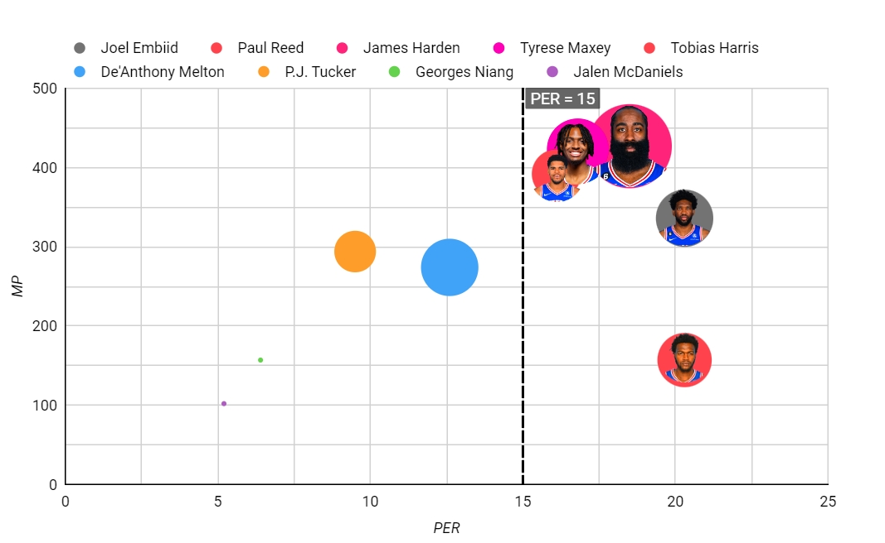

Tools: 

* Google Data Studio for visualization (maybe also dashboards),

* Tableau for dashboards

* Flourish for some fancy gifs

* Python for Predictions

Ideas: 

* Visualization before introducing the model:

Use Tableau and Google Data Studio to do some visualization for an explanation. For example, we need to let every audience know our criteria (attributes we use) for rating players. For example, I used DBPM and OBPM (Defensive and offensive box plus/minus) to judge the performance of a player in playoffs and visualize it by Tableau. (See my Tableau demo at https://public.tableau.com/app/profile/zixuan.xu7872/viz/correct_demo/Sheet2?publish=yes) My plan is to first do some visualization like this to guide the audience to gradually understand some necessary NBA knowledge and then introduce our model accordingly.
For demo visualization using Google Data Studio, please see the picture below.

* ML models for prediction:

a. Build a player rating and team rating model. Like NBA 2K, we can formulate an algorithm to give each player a rating value. For example, we can respectively calculate the offense rating and defense rating in the regular season and playoffs of a player. Similarly, we can formulate an algorithm to compute the team's rating.

b. Build a model to predict if teams A and B have a match, which team will win the game. This can be trained based on the games in previous years.

c. Load the game schedule of the 2023-24 regular season.

d. Predict which team will finally be in the playoffs after 82 games in the regular season, by running our prediction models with regular-season ratings for a single game.

e. Get the schedule for playoffs by the results of the simulated regular season, then run models with playoffs' ratings again based on the rules of playoffs.

f. Obtain the final results for all teams. (Did not make it to the playoffs， Eliminated in the first round of the playoffs， Eliminated in the second round of the playoffs， Eliminated in the conference finals, Eliminated in the finals, and the champion.) 

g. Repeat the above process many times to eventually obtain the probability of the final record for each team.

* Visualization after the prediction:

a. Visualize the probability of the final record for each team.

b. make some fancy chart by Flourish, like a bar chart race gif.

* Things to do from now on:

a. Choose at least one Topic: Visualization or Modeling.

b. If you choose Visualization, then choose one or two tools (Google Data Studio, Tableau, Flourish, or other tools you find) you want to dive into. Find materials online to learn how to make good plots using the tools you choose, and also try your best to find good plots and visualization for NBA data and players' performances online. For all the visualization, we must ensure the meaningfulness, usefulness, and easy-to-understand first, if available, we also wanna pursue novelty and extravagance then. We can find good visualization ideas together. 

c. If you choose Modeling, then we need to find ways to rate players first, it may need research work. Then we build the model following the steps above step by step.

d. Both topics require learning new things, the modeling part is more difficult technically, it is more like the Data Scientist work, and the Visualization part requires more creativity,  it is more like the Data Analyst work. Please make your choice by the end of this week, so that we can dive into our work in more specific groups. 

Thank you!

